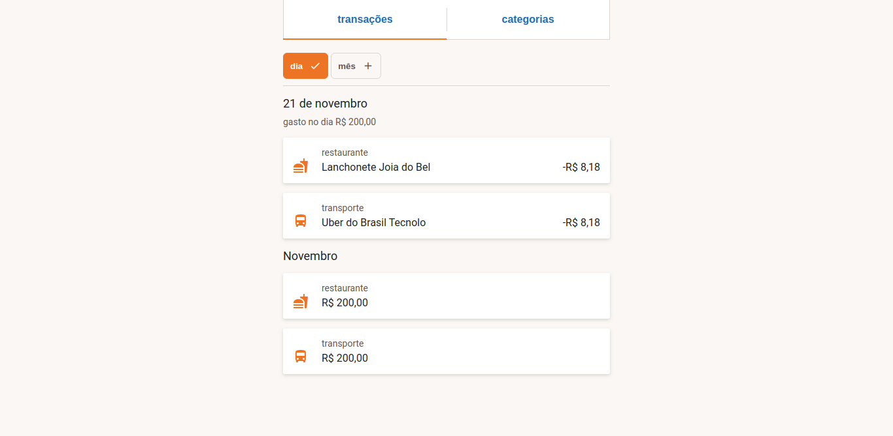

# Challenge

### Instruções para construir a aplicação:
1. Consumir o endpoint /transactions para listar transações
2. Criar layout utilizando técnicas de display:flex
3. Criar sistema de abas (transações & categorias)
- 3.1 Aba transações:
    1. Listar transações com o ícone, categoria (chave title), descrição e preço
    2. Mostrar ícone de acordo com a categoria (chave title)
    3. Criar filtro para agrupar transações por dia (Padrão)
    4. Criar filtro para agrupar transações por mês
- 3.2 Aba categorias
    1. Agrupar categorias (chave title) por mês e calcular seu valor com base na transações correspondentes

### Assets:
    - (texto) <link href="https://fonts.googleapis.com/css?family=Roboto&display=swap" rel="stylesheet" />
    - (icones) <link href="https://fonts.googleapis.com/icon?family=Material+Icons" rel="stylesheet" />

### Links para consulta:
- repo material icon: https://material.io/resources/icons/?style=baseline
- flexbox froggy: https://flexboxfroggy.com/

### Colors:
    - primary-color: #ec7424;
    - page-background: #fbf7f4;
    - light-gray: #d9d6d1;
    - dark-gray: #5f5650;
    - gray: #dad5d2;
    - white: #fff;
    - text-color: #221d1a;
    - blue: #216daf;

### Referência layout:

## Como rodar o projeto?
- **npm ci** ou **npm install**: para instalar as dependências
- **npm start**: para rodar o projeto em modo de desenvolvimento
